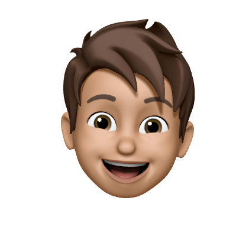

  

<h1 align="center"><a href="https://www.google.com/">DaniDuese#0001</a></h1>

<!--

-->

### Hi there 👋,
I am a 16 year old self taught full stack web developer and grapics designer. I really love coding, which I started around 4 years ago. I regularly code in python and html/css, but I also know Java, Node.js, C#, C++, Go and Swift just to name some of my favourites.

<!--
**DaniEnsi/DaniEnsi** is a ✨ _special_ ✨ repository because its `README.md` (this file) appears on your GitHub profile.

Here are some ideas to get you started:

- 🔭 I’m currently working on ...
- 🌱 I’m currently learning ...
- 👯 I’m looking to collaborate on ...
- 🤔 I’m looking for help with ...
- 💬 Ask me about ...
- 📫 How to reach me: ...
- 😄 Pronouns: ...
- ⚡ Fun fact: ...
-->
